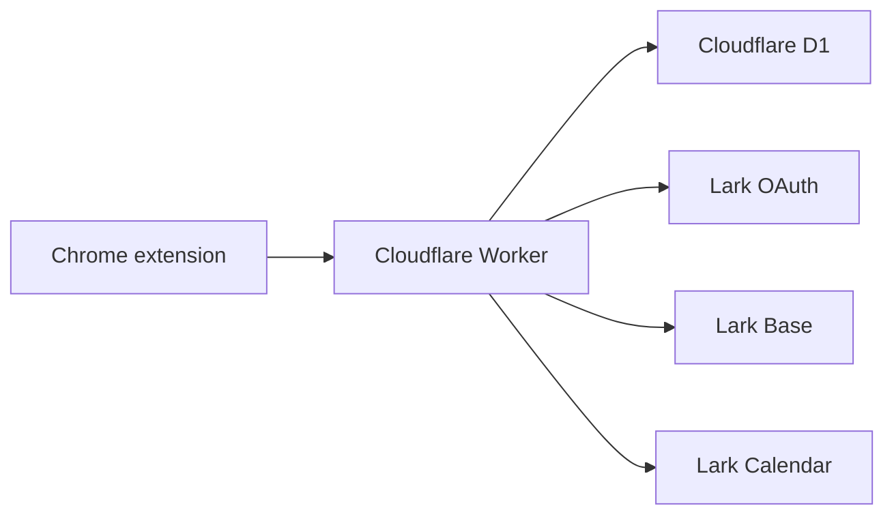

# Reading Block for Lark

Self-hosted Chrome extension + Cloudflare Worker for saving articles to Lark Base and automatically scheduling reading blocks on Lark Calendar.

中文文档: [README.zh-CN.md](README.zh-CN.md)

## What It Does

- One-click save from Chrome into a personal Lark Base.
- Each signed-in user gets their own automatically created Base.
- After enough unread saves are collected, the Worker finds a free Lark Calendar slot and creates a Reading Block event.
- OAuth login uses Lark. Tokens are encrypted before they are stored in Cloudflare D1.
- The extension can be packed as an unpacked Chrome extension or a zip.

This is not an official Lark product.

## Architecture



## Quick Start

Read the full setup guide first: [SELF_HOSTING.md](SELF_HOSTING.md).

```bash
cp .env.example .env
npm run configure
npm test
npm run package:extension
```

You also need to create a Lark app, create a Cloudflare D1 database, set Worker secrets, run D1 migrations, and deploy the Worker.

## Repository Layout

- `extension/`: Chrome extension source.
- `worker/`: Cloudflare Worker API and D1 migrations.
- `scripts/`: configuration and packaging helpers.
- `test/`: Node tests for scheduling, CORS, downloads, and Worker flow.
- `docs/`: focused setup notes.
- `AGENTS.md`: concise instructions for coding agents.

## Generated Files

The following files are intentionally ignored because they contain deployment-specific values:

- `wrangler.jsonc`
- `extension/manifest.json`
- `extension/src/lib/config.js`
- `.env`
- `.dev.vars`
- `dist/`

## License

MIT
