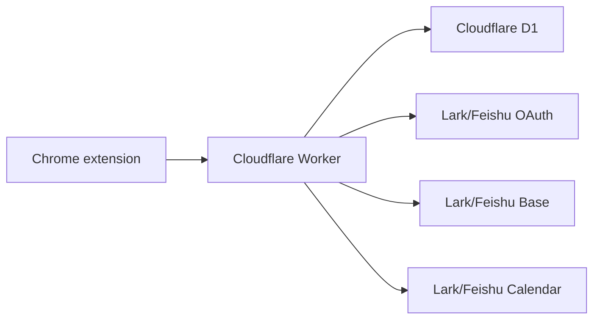

# Reading Block for Lark

Self-hosted Chrome extension + Cloudflare Worker for saving articles to Lark/Feishu Base and automatically scheduling reading blocks on Lark/Feishu Calendar.

中文文档: [README.zh-CN.md](README.zh-CN.md)

## What It Does

- One-click save from Chrome into a personal Lark/Feishu Base.
- Each signed-in user gets their own automatically created Base.
- After enough unread saves are collected, the Worker finds a free Lark/Feishu Calendar slot and creates a Reading Block event.
- OAuth login uses Lark or Feishu. Tokens are encrypted before they are stored in Cloudflare D1.
- The extension can be packed as an unpacked Chrome extension or a zip.

This is not an official Lark or Feishu product.

## Architecture



## Quick Start

Read the full setup guide first: [SELF_HOSTING.md](SELF_HOSTING.md).

```bash
cp .env.example .env
npm run configure
npm test
npm run package:extension
```

You also need to create a Lark or Feishu app, create a Cloudflare D1 database, set Worker secrets, run D1 migrations, and deploy the Worker.

## Agent-Assisted Setup

You can hand this repository to a coding agent. Ask the agent to read [AGENTS.md](AGENTS.md) first; it contains the full setup runbook, human checkpoints, and verification steps.

Copy this prompt:

```text
Please help me self-host this repository. First read AGENTS.md, then guide me through the full install: Lark/Feishu app setup, Cloudflare Worker/D1 configuration, secret setup, migrations, deployment, extension packaging, Chrome installation, OAuth authorization, and final verification. Pause whenever I need to log in, approve browser authorization, enter secrets, configure developer console settings, bind a domain, or install the extension manually. Do not commit generated config files or secrets.
```

The agent can automate repo edits, config generation, migrations, deploy commands, tests, and packaging when tools and permissions are available. The human still needs to complete Cloudflare login, Lark/Feishu developer console setup, secret entry, browser OAuth approval, domain binding approval, and Chrome extension installation.

## Repository Layout

- `extension/`: Chrome extension source.
- `worker/`: Cloudflare Worker API and D1 migrations.
- `scripts/`: configuration and packaging helpers.
- `test/`: Node tests for scheduling, CORS, downloads, and Worker flow.
- `docs/`: focused setup notes.
- `AGENTS.md`: full setup runbook for coding agents.
- `AGENT.md`: short entry point that points agents to `AGENTS.md`.

## Generated Files

The following files are intentionally ignored because they contain deployment-specific values:

- `wrangler.jsonc`
- `extension/manifest.json`
- `extension/src/lib/config.js`
- `.env`
- `.dev.vars`
- `dist/`

## References

This project was inspired by [zarazhangrui/reading-block-lark](https://github.com/zarazhangrui/reading-block-lark).

## License

MIT
