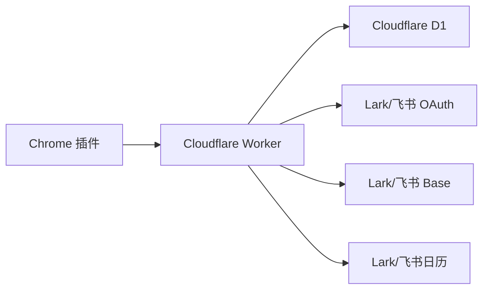

# Reading Block for Lark

这是一个自托管的 Chrome 插件 + Cloudflare Worker 项目：在浏览器里一键收藏网页，自动写入 Lark/飞书多维表格，并在 Lark/飞书日历里自动创建 Reading Block。

English: [README.md](README.md)

## 功能

- Chrome 工具栏一键保存当前页面。
- 每个登录用户自动创建自己的 Lark/飞书 Base。
- 保存数量达到阈值后，Worker 会查找空闲时间并创建 Lark/飞书日历事件。
- 使用 Lark 或飞书 OAuth 登录，Token 加密后存到 Cloudflare D1。
- 支持打包为本地可安装的 Chrome extension zip。

这不是 Lark 或飞书官方产品。

## 架构



## 快速入口

完整部署步骤看这里：[SELF_HOSTING.zh-CN.md](SELF_HOSTING.zh-CN.md)。

```bash
cp .env.example .env
npm run configure
npm test
npm run package:extension
```

正式使用前还需要创建 Lark 或飞书应用、创建 Cloudflare D1、配置 Worker secrets、执行 D1 migrations，并部署 Worker。

## 目录

- `extension/`：Chrome 插件源码。
- `worker/`：Cloudflare Worker API 和 D1 migrations。
- `scripts/`：配置生成和扩展打包脚本。
- `test/`：调度、CORS、下载、Worker 主流程测试。
- `docs/`：分主题配置文档。
- `AGENTS.md`：给后续编码 agent 读取的项目说明。

## 不提交的生成文件

这些文件包含部署相关配置，默认不会提交：

- `wrangler.jsonc`
- `extension/manifest.json`
- `extension/src/lib/config.js`
- `.env`
- `.dev.vars`
- `dist/`

## 参考

本项目参考了 [zarazhangrui/reading-block-lark](https://github.com/zarazhangrui/reading-block-lark) 的想法和实现方向。

## License

MIT
